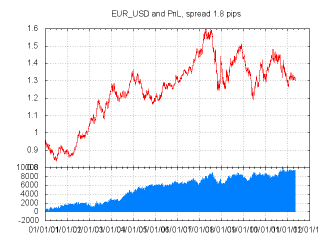
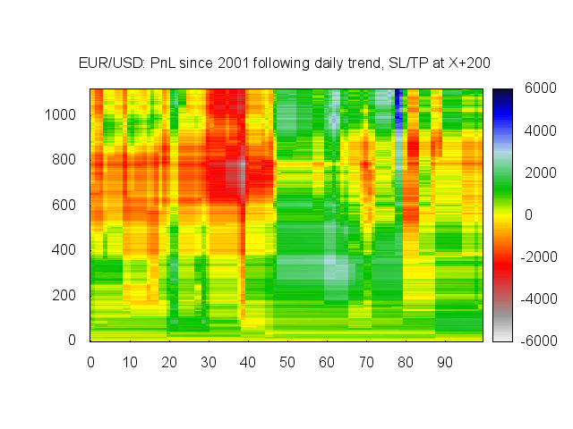

# Backtest your eForex trading strategies

#### Goal

Ever wondered what would have happened if you had always followed the trend? or if you had played against the market? or if you had set a take-profit of twice as much as the stop-loss?

`efx-backtest` is a minimalist eForex backtest engine. It lets you implement an automatic trading strategy in a few lines of Python and provides you with a profit-and-loss chart as well as simple metrics.

#### Usage

Implement the class Strategy. The simulation engine (`market.py`) will call `order_for_price(p)` with each price in the histoy file. For each price, the Strategy instance is expected to return a BUY or SELL order (instance of Order) or `None` if nothing is to be done. See `Strategy.py` for an implementation example.

The cumulated PnL is written on stdout and can be ploted by gnuplot. Metrics are written on stderr.

    $ python market.py > pnl.txt && gnuplot pnl.gnuplot && open pnl.png

    number of prices : 2949
    number of trades : 256 (145 win, 110 lose)
    max_exposure     : 10000.000000
    realized pnl     : 9271.000000
    unrealized pnl   : 205.000000

#### Heatmap

In `market.py`, `HEATMAP = True` instanciates several strategies with a parameter. It runs the whole history with each strategy instance. It then outputs heatmap data, usable by `heatmap.gnuplot`.

    $ python market.py > heatmap.txt && gnuplot heatmap.gnuplot && open heatmap.png

In the following heatmap, we can see that following the trend of the previous day on EUR/USD since 2001 and a SL/TP at ± 278 pips would have resulted in a 6000 pips profit after 1000 days (with a max. exposure of 10k USD).

